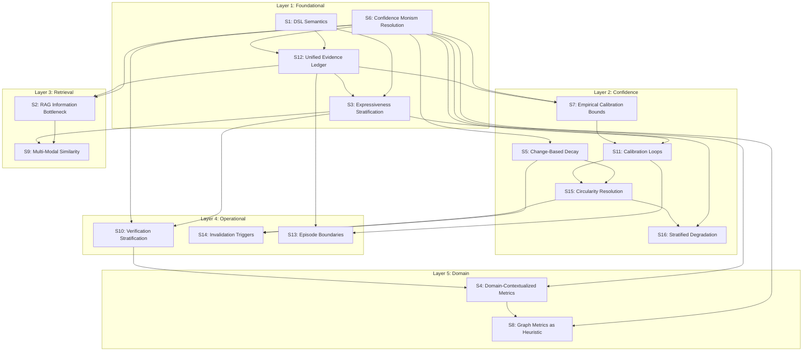

# Implementation Dependencies: S1-S16 Solutions

> **Source**: THEORETICAL_CRITIQUE.md Part IV (Solution Propagation Framework)
>
> **Purpose**: Define the interaction and implementation order across all theoretical solutions (S1-S16)
>
> **Last Updated**: 2026-01-23

---

## Overview

The 16 solutions identified in THEORETICAL_CRITIQUE.md are not independent. Implementing one affects others. This spec maps the interactions, cascade effects, and correct implementation order.

---

## Dependency Layers

### Layer 1: Foundational (Implement First)

These solutions establish the semantic and type-theoretic foundation. All other layers depend on them.

| Solution | Name | Description | Dependencies |
|----------|------|-------------|--------------|
| **S1** | DSL Semantics | Formal semantics for technique composition DSL | None |
| **S6** | Confidence Monism Resolution | Type-stratified confidence model | None |
| **S12** | Unified Evidence Ledger | Category-typed primitives with evidence tracking | S1, S6 |
| **S3** | Expressiveness Stratification | Stratum-based primitive classification | S1, S12 |

**Why First**: Without formal semantics (S1) and principled confidence (S6), all downstream solutions build on undefined foundations. The evidence ledger (S12) and stratification (S3) depend on these definitions.

### Layer 2: Confidence Layer

These solutions refine the confidence model with empirical grounding and proper invalidation.

| Solution | Name | Description | Dependencies |
|----------|------|-------------|--------------|
| **S5** | Time Decay to Change-Based Decay | Replace arbitrary time decay with change-triggered invalidation | S6 |
| **S7** | Empirical Calibration Bounds | Replace arbitrary bounds with empirically derived values | S6, S12 |
| **S11** | Calibration Loops | Feedback loops from outcomes to confidence | S6, S7 |
| **S15** | Circularity Resolution | Unified invalidation model | S5, S11 |
| **S16** | Stratified Degradation | Causal attribution for confidence decay | S6, S15 |

**Why Second**: Confidence refinement requires the type system (S6) to exist first. These solutions transform "wishes" into "measurements" through empirical grounding.

### Layer 3: Retrieval Layer

These solutions address retrieval honesty and multi-modal similarity.

| Solution | Name | Description | Dependencies |
|----------|------|-------------|--------------|
| **S2** | RAG Information Bottleneck | Quantify retrieval uncertainty explicitly | S6, S12 |
| **S9** | Multi-Modal Similarity | Hybrid structural/semantic/behavioral similarity | S2, S3 |

**Why Third**: Retrieval depends on having a principled confidence model (Layer 2) and evidence ledger (Layer 1) to express uncertainty honestly.

### Layer 4: Operational Layer

These solutions address runtime behavior: verification, invalidation, and episode management.

| Solution | Name | Description | Dependencies |
|----------|------|-------------|--------------|
| **S10** | Verification Stratification | Stratified verification based on knowledge type | S3, S6 |
| **S14** | Invalidation Triggers | Event-driven invalidation from git/file changes | S5, S15 |
| **S13** | Episode Boundaries | Clean episode isolation for learning | S11, S12 |

**Why Fourth**: Operations require the confidence model (Layer 2) and retrieval (Layer 3) to be defined.

### Layer 5: Domain Layer

These solutions extend the system to domain-specific applications.

| Solution | Name | Description | Dependencies |
|----------|------|-------------|--------------|
| **S4** | Domain-Contextualized Metrics | Per-domain confidence interpretation | S6, S10 |
| **S8** | Graph Metrics as Heuristic | Treat graph centrality as heuristic, not ground truth | S3, S4 |

**Why Last**: Domain extensions require all foundational, confidence, retrieval, and operational layers to exist.

---

## Dependency Graph (Mermaid)



---

## Cascade Effects Table

When a solution fails or is incomplete, these downstream solutions are affected:

| If X Fails | These Break | Severity | Mitigation |
|------------|-------------|----------|------------|
| **S1** (DSL Semantics) | S3, S12, and all downstream | CRITICAL | Cannot proceed without formal semantics |
| **S6** (Confidence Monism) | S5, S7, S11, S15, S16, S2, S10, S4 | CRITICAL | All confidence-aware solutions fail |
| **S12** (Evidence Ledger) | S3, S7, S2, S13 | HIGH | Evidence tracking degrades to ad-hoc logging |
| **S3** (Stratification) | S9, S10, S8 | HIGH | Primitive classification becomes arbitrary |
| **S5** (Change-Based Decay) | S15, S14 | MEDIUM | Falls back to time-based decay (less accurate) |
| **S7** (Calibration Bounds) | S11 | MEDIUM | Uses arbitrary bounds (less trustworthy) |
| **S11** (Calibration Loops) | S15, S13 | MEDIUM | No feedback from outcomes to confidence |
| **S15** (Circularity Resolution) | S16, S14 | MEDIUM | Invalidation remains fragmented |
| **S2** (RAG Bottleneck) | S9 | LOW | Retrieval uncertainty unquantified |
| **S9** (Multi-Modal Similarity) | None | LOW | Falls back to single-mode similarity |
| **S10** (Verification Stratification) | S4 | LOW | Verification is uniform (less efficient) |
| **S16** (Causal Attribution) | None | LOW | Attribution remains heuristic |
| **S14** (Invalidation Triggers) | None | LOW | Falls back to periodic invalidation |
| **S13** (Episode Boundaries) | None | LOW | Episodes may have unclear boundaries |
| **S4** (Domain Metrics) | S8 | LOW | Domain-agnostic metrics used |
| **S8** (Graph Heuristics) | None | LOW | Graph metrics treated as ground truth |

### Critical Path

The critical path through the dependency graph is:

```
S1 --> S6 --> S12 --> S3 --> S6 --> S5 --> S15 --> S16
                           --> S7 --> S11 --^
```

**Do not skip S1, S6, or S12.** All other solutions depend on them.

---

## Implementation Order (Recommended)

### Phase 1: Foundational (Week 1-2)

| Order | Solution | LOC Est. | Acceptance Criteria |
|-------|----------|----------|---------------------|
| 1 | S1: DSL Semantics | ~300 | Formal grammar + denotational semantics defined |
| 2 | S6: Confidence Monism Resolution | ~200 | TypedConfidence replaces all raw numbers |
| 3 | S12: Unified Evidence Ledger | ~400 | Single ledger with stable IDs across subsystems |
| 4 | S3: Expressiveness Stratification | ~150 | All primitives classified into strata |

**Gate**: Foundational layer complete when `rg "confidence:\s*0\.\d" | wc -l` returns 0 and evidence ledger has unified schema.

### Phase 2: Confidence Model (Week 3-4)

| Order | Solution | LOC Est. | Acceptance Criteria |
|-------|----------|----------|---------------------|
| 5 | S5: Change-Based Decay | ~150 | Decay triggers from git/file events only |
| 6 | S7: Empirical Calibration Bounds | ~200 | Bounds derived from historical data |
| 7 | S11: Calibration Loops | ~250 | Outcomes feed back to confidence |
| 8 | S15: Circularity Resolution | ~150 | Single invalidation model |
| 9 | S16: Stratified Degradation | ~150 | Causal attribution for decay |

**Gate**: Confidence layer complete when calibration curves exist for each knowledge type.

### Phase 3: Retrieval (Week 5)

| Order | Solution | LOC Est. | Acceptance Criteria |
|-------|----------|----------|---------------------|
| 10 | S2: RAG Information Bottleneck | ~200 | Retrieval returns uncertainty bounds |
| 11 | S9: Multi-Modal Similarity | ~300 | Hybrid similarity implemented |

**Gate**: Retrieval layer complete when queries include uncertainty estimates.

### Phase 4: Operational (Week 6)

| Order | Solution | LOC Est. | Acceptance Criteria |
|-------|----------|----------|---------------------|
| 12 | S10: Verification Stratification | ~150 | Per-type verification methods |
| 13 | S14: Invalidation Triggers | ~200 | Git hooks trigger invalidation |
| 14 | S13: Episode Boundaries | ~150 | Episodes have clear start/end |

**Gate**: Operational layer complete when invalidation is event-driven.

### Phase 5: Domain (Week 7)

| Order | Solution | LOC Est. | Acceptance Criteria |
|-------|----------|----------|---------------------|
| 15 | S4: Domain-Contextualized Metrics | ~200 | Per-domain confidence interpretation |
| 16 | S8: Graph Metrics as Heuristic | ~100 | Graph metrics marked as heuristic |

**Gate**: Domain layer complete when domain-specific calibration exists.

---

## Migration Strategy

For each solution that changes existing data structures:

### Step 1: Define New Structure

```typescript
// New alongside old
interface TypedConfidence {
  type: 'syntactic' | 'behavioral' | 'intentional' | 'normative' | 'predictive';
  raw: number;
  calibrated: number;
  calibrationStatus: 'uncalibrated' | 'calibrating' | 'calibrated';
}
```

### Step 2: Implement Adapter

```typescript
// Bridge old and new
interface ConfidenceAdapter {
  /** Read old format, return new format */
  read(old: number): TypedConfidence;

  /** Write new format, store in compatible way */
  write(new_: TypedConfidence): void;

  /** Check if migration needed */
  needsMigration(entity: Entity): boolean;
}
```

### Step 3: Migrate Incrementally

```typescript
// Lazy migration on access
async function getConfidence(entityId: string): Promise<TypedConfidence> {
  const entity = await storage.get(entityId);

  if (adapter.needsMigration(entity)) {
    const migrated = adapter.read(entity.confidence);
    await storage.update(entityId, { confidence: migrated });
    return migrated;
  }

  return entity.confidence;
}
```

### Step 4: Remove Old Structure

Once migration is complete (tracked by audit):

```bash
# Verify migration complete
node scripts/check_migration_status.mjs --solution S6

# Remove old code paths
git rm src/legacy/raw_confidence.ts
```

---

## Incremental Transition Checklist

### Per-Solution Checklist

For each solution S[N]:

- [ ] **Design Review**: Spec reviewed against THEORETICAL_CRITIQUE.md
- [ ] **Dependency Check**: All upstream solutions (see graph) are complete
- [ ] **Adapter Created**: Migration adapter exists if data structures change
- [ ] **Implementation**: Code written and type-checks
- [ ] **Tests**: Unit tests pass in isolation
- [ ] **Integration**: Downstream solutions still work
- [ ] **Migration Run**: Existing data migrated via adapter
- [ ] **Evidence Command**: Verification command documented and passing
- [ ] **Old Code Removed**: Legacy paths deleted

### Rollback Plan

If a solution breaks downstream consumers:

1. **Revert PR**: Git revert the solution commit
2. **Adapter Bypass**: Use adapter to present old interface
3. **Audit**: Document what broke and why
4. **Fix Forward**: Address root cause, not symptoms

---

## Cross-Reference to Tracks

| Solution | Primary Track | Secondary Tracks |
|----------|---------------|------------------|
| S1 | track-a-core-pipeline | layer2-infrastructure |
| S2 | track-g-retrieval-uncertainty | track-a-core-pipeline |
| S3 | track-e-domain | track-d-quantification |
| S4 | track-e-domain | track-f-calibration |
| S5 | track-f-calibration | track-j-dynamics |
| S6 | track-d-quantification | CONFIDENCE_REDESIGN |
| S7 | track-f-calibration | track-d-quantification |
| S8 | track-c-hierarchical-knowledge | track-e-domain |
| S9 | track-g-retrieval-uncertainty | track-e-domain |
| S10 | track-f-epistemology | track-b-bootstrap |
| S11 | track-f-calibration | track-f-epistemology |
| S12 | layer2-infrastructure | track-a-core-pipeline |
| S13 | track-j-dynamics | track-c-extended |
| S14 | track-j-dynamics | track-f-calibration |
| S15 | track-f-calibration | track-j-dynamics |
| S16 | track-f-calibration | track-j-dynamics |

---

## Evidence Commands

### Layer 1 Verification

```bash
# S1: DSL Semantics - grammar defined
rg "type.*Composition.*=" packages/librarian/src/types/

# S6: No raw confidence numbers
rg "confidence:\s*0\.\d" packages/librarian/src --glob '*.ts' | wc -l
# Target: 0

# S12: Unified evidence ledger
rg "EvidenceEntry" packages/librarian/src --glob '*.ts' | wc -l
# Target: Single definition, multiple usages

# S3: Stratification defined
rg "stratum|Stratum" packages/librarian/src --glob '*.ts'
```

### Layer 2 Verification

```bash
# S5: Change-based decay
rg "decayOnChange|changeBasedDecay" packages/librarian/src

# S7: Empirical bounds
rg "calibrationBounds|empiricalBounds" packages/librarian/src

# S11: Calibration loops
rg "CalibrationLoop|feedbackLoop" packages/librarian/src

# S15/S16: Unified invalidation
rg "InvalidationTrigger|causalAttribution" packages/librarian/src
```

### Layer 3-5 Verification

```bash
# S2: Retrieval uncertainty
rg "retrievalUncertainty|uncertaintyBounds" packages/librarian/src

# S9: Multi-modal similarity
rg "multiModalSimilarity|hybridSimilarity" packages/librarian/src

# S10: Verification stratification
rg "verificationStrategy|stratifiedVerification" packages/librarian/src

# S4/S8: Domain metrics
rg "domainMetrics|graphHeuristic" packages/librarian/src
```

---

## Summary

The 16 solutions form a layered dependency graph:

1. **Foundational** (S1, S6, S12, S3): Semantic and type-theoretic foundation
2. **Confidence** (S5, S7, S11, S15, S16): Empirical grounding for confidence
3. **Retrieval** (S2, S9): Honest retrieval with uncertainty
4. **Operational** (S10, S14, S13): Runtime behavior
5. **Domain** (S4, S8): Domain-specific extensions

**Critical constraint**: Do not implement Layer N+1 solutions before Layer N is complete. Violating this creates "paper capability" - solutions that appear to work but lack foundational support.

**Total estimated LOC**: ~3,050 across all 16 solutions.
